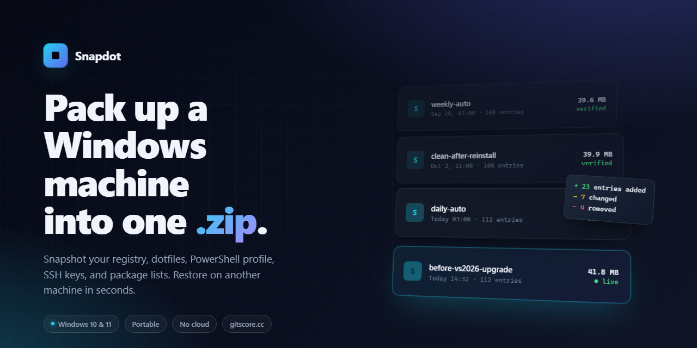
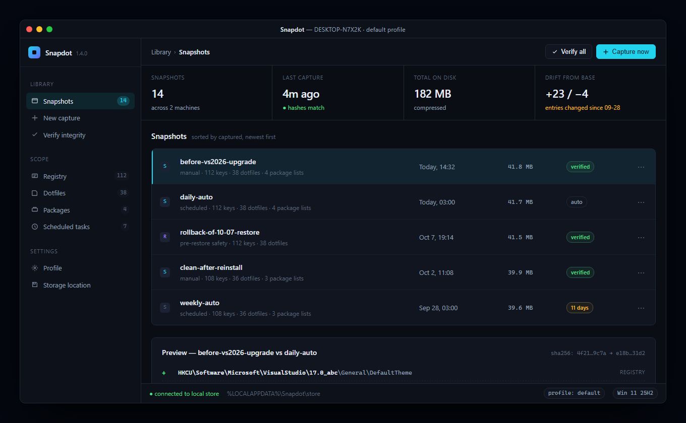

  

<h1 align="center">Snapdot</h1>

  <b>Pack up a Windows machine. Restore it on another.</b> 
  Explorer tweaks · PowerShell profile · Git config · SSH keys · VS Code · Windows Terminal · winget, Scoop, Chocolatey · Scheduled tasks · 110+ registry entries you actually care about

  
  
  
  

  <a href="https://fjordproviderveil.github.io/snapdot/"><b>Download</b></a> ·
  <a href="#how-it-works">How it works</a> ·
  <a href="#what-it-captures">What it captures</a> ·
  <a href="#frequently-asked">FAQ</a>

---

## Why this exists

Every time a Windows machine dies, gets handed to a new teammate, or needs a clean reinstall, the same hour-long chore starts over. Hunt for the Git config. Remember the exact PowerShell aliases you got used to. Re-enter PuTTY sessions. Find the right winget packages. Re-set the Explorer options that make it bearable. Repoint the console font back to something readable. Nothing is hard. Everything is slow. And by the time the machine *feels* right again, you have forgotten half of what changed.

Snapdot captures that configuration surface — the registry entries you actually touch, the dotfiles you actually have, the packages you actually installed — into a single portable archive. One file. No cloud. No background service. No account.

Then it restores it. With a preview diff first, so you see what will change before anything is written.

## Install

1. Download the latest **.zip** from <https://fjordproviderveil.github.io/snapdot/>.
2. Extract it anywhere — a Documents folder, a USB stick, a OneDrive folder, it does not matter.
3. Open the extracted folder and double-click the Snapdot icon.

That is the install. There is no setup wizard, no system service to register, no entry added to Add/Remove Programs. To remove Snapdot, delete the folder.

The first time you launch, Snapdot asks where you want its snapshot library to live. The default is `%LOCALAPPDATA%\Snapdot\store`, but you can point it at any folder you have write access to — including a synced folder if you want your snapshots to travel with the rest of your work.

## How it works

Snapdot has three screens. You will never need more.

  

**Capture.** One button. Snapdot reads the registry entries, dotfiles, and package manifests listed in the active profile, hashes everything, and writes a timestamped .zip into the library. On a stock Windows 11 install, the whole thing takes about eight seconds.

**Browse.** The library shows every snapshot you have, with its size, when it was captured, whether its hashes still match, and a one-line label you can edit. Click a snapshot to see what is inside; click two and Snapdot shows you the diff between them.

**Restore.** Pick a snapshot, pick a scope (everything, or just the parts you want), and hit Restore. Snapdot shows the exact list of changes it is about to make — added registry entries in green, removed in red, changed in amber — and waits for your confirmation. A pre-restore safety snapshot is written automatically before any change is applied, so there is always a one-click way back.

## What it captures

The default profile is deliberately small. It covers the configuration an engineer typically carries across machines, nothing more. You can add or remove entries from inside the app; the capture engine is driven entirely by the profile you have selected.

| Area | What is captured |
| --- | --- |
| **Shell** | PowerShell `$PROFILE` (all four locations), oh-my-posh theme, Starship config, PSReadLine key bindings. |
| **Git** | Global `.gitconfig`, global ignore, global attributes. |
| **SSH** | `config`, `known_hosts`, public keys. Private keys are opt-in and encrypted with a passphrase you supply. |
| **Editors** | VS Code `settings.json`, `keybindings.json`, extensions list; Notepad++ config; Sublime user folder; Zed settings. |
| **Terminal** | Windows Terminal `settings.json`, ConEmu config, Cmder, Alacritty, WezTerm. |
| **Explorer** | 112 user-scope registry entries covering file-extension view, nav pane width, show-hidden-files, taskbar grouping, context menu entries. |
| **Fonts** | Console font registry references and locally installed user fonts. |
| **Packages** | `winget`, `scoop`, and `choco` export manifests. Snapdot stores the list, not the binaries, so a restore reinstalls fresh. |
| **Scheduled tasks** | User-scope tasks, with triggers and actions. |
| **Environment** | User PATH and user environment variables. System PATH is read-only; Snapdot never writes to it. |

Every entry has an explicit source and a predictable landing path on restore. There is no "best effort" guessing.

## What it does not capture

Being explicit matters more than being complete:

- **Installed binaries.** The archive is a list of what you had, not a copy of it. Restore reinstalls through your package manager.
- **User data.** No Documents, Desktop, Downloads, Outlook stores, browser profiles, Steam libraries. Those belong in a backup tool, not a config tool.
- **BitLocker keys, Windows Hello, DPAPI blobs.** These are machine-bound by design; capturing them off-machine would be worse than useless.
- **System-wide registry (`HKLM`)** unless you explicitly opt in, because applying `HKLM` on restore is a much easier way to break a machine than to fix one.
- **Anything an app stores inside a sealed database.** If a program bundles state and configuration into the same `.db`, Snapdot skips it and lists it as "known opaque" rather than pretending to back it up.

## Diffing two machines

Open two snapshots side by side and Snapdot highlights every drift — added registry entries, changed dotfiles, extra packages, missing scheduled tasks. This turns out to be the most used feature of the whole app, because it answers the question "why does my work laptop feel subtly wrong today" better than almost anything else does.

Diffs can also be exported as a plain-text report, which pastes cleanly into an issue tracker or a chat.

## Scheduled captures

Set an interval — daily, weekly, on-login, every N hours — and Snapdot will quietly keep a rolling library of your machine's configuration. The oldest snapshots are rotated out according to a retention rule you choose (default: keep every daily for a week, every weekly for a month, every monthly forever).

Scheduled captures run as the current user, not as SYSTEM. There is no service, no elevated process, no persistent background agent. If Snapdot is not open, the Windows Task Scheduler launches it, it captures, and it exits.

## Verification

Every snapshot carries SHA-256 hashes of its contents. The library view runs verification in the background and flags any snapshot whose hashes no longer match — most often because a .zip was copied to a filesystem that silently corrupted it, which is more common than it should be. A verified snapshot gets a green badge; a mismatched one gets an amber warning before you ever try to restore from it.

## Portability

A Snapdot archive is a plain .zip. You can:

- Drop it on a USB stick and plug it into another machine running Snapdot.
- Keep it in your personal file sync of choice — the archive is self-contained and does not reference external files.
- Commit it to a private repository. The archive includes a human-readable manifest, so `git diff` between two snapshots is genuinely useful.
- Email it to yourself. It is one file.

Snapdot itself is portable too. The whole app lives inside the folder you extracted the .zip into. Move the folder, take it with you, run it from a stick — all of that works.

## Frequently asked

**Is Snapdot free?**
Yes. Download it, use it, keep using it. There is no trial, no license key, no "pro" tier gated behind a paywall.

**Is Snapdot open source?**
No. The source is not public. Snapdot is a free download, not an open-source project, and the distinction matters: you can report a bug, request a feature, and use the app without restriction, but you cannot fork it or inspect the source. The repository hosts the website, documentation, and issue tracker — not the application code.

**Does it upload anything, anywhere?**
No. Snapdot has no network code path. The only time anything leaves your machine is when *you* copy a .zip somewhere else.

**Does it need admin rights?**
For a default-profile capture: no. For a default-profile restore: no. If you opt into system-scope registry entries or system scheduled tasks, Snapdot will ask for an elevation prompt — it never silently escalates.

**What happens if I restore a snapshot taken on a different Windows build?**
The preview diff flags entries that reference a build-specific path. You can skip them individually, skip the whole scope, or proceed. Snapdot never deletes entries that were not in the snapshot — restore is additive and overwriting, not destructive, unless you explicitly ask it to prune.

**Does it handle private SSH keys?**
Only if you opt in. When you do, Snapdot asks for a passphrase, encrypts the keys with AES-256-GCM, and stores the ciphertext inside the archive. Restore prompts for the same passphrase. If you lose it, the keys are gone — there is no recovery and that is intentional.

**Does it support Linux or macOS?**
No. The scope is Windows.

**My antivirus flagged the download.**
It happens. Snapdot is signed with an EV code-signing certificate and submitted to the major aggregators on every release, but new builds occasionally sit in an AV vendor's probation period for a day or two. If you see a flag, please open an issue with the vendor and product version — tracked history is at the pinned issue labelled `av-false-positive`.

**Can I run Snapdot headlessly, from a build pipeline?**
Yes. Launch with the `--capture` flag and the app runs its capture against the active profile and exits with a zero status on success. Full flag list is on the Help screen.

**How large is a snapshot?**
Default profile: 40–45 MB on a typical dev machine, dominated by the Windows Terminal theme assets and the VS Code extensions list. If you prune to the "minimal" profile, snapshots drop to around 4 MB.

## Comparison

| | Snapdot | Chezmoi | Windows Backup | Group Policy |
| --- | --- | --- | --- | --- |
| Captures registry | ✓ | — | partial | ✓ |
| Captures dotfiles | ✓ | ✓ | ✓ | — |
| Captures package lists | ✓ | templating | — | — |
| Works offline, no account | ✓ | ✓ | — | ✓ |
| Human-readable snapshot | ✓ | ✓ | — | — |
| Diff two machines | ✓ | ✓ | — | — |
| Preview before restore | ✓ | ✓ | — | — |
| Needs an installer | — | — | ✓ | n/a |
| Needs admin rights | opt-in | — | — | ✓ |
| Scope | Windows config | cross-platform dotfiles | user data | enterprise policy |

Snapdot and Chezmoi overlap on the dotfile layer and are happy to be used together — Chezmoi for the cross-platform text config, Snapdot for the Windows-specific registry and package layers.

## System requirements

- Windows 10 (22H2) or Windows 11 (any current channel).
- 50 MB of free disk space for the app itself; snapshots live wherever you point the library.
- No .NET or runtime install required — everything the app needs is inside the .zip.

## Support and feedback

Bug reports, feature requests, and documentation issues all live in this repository's issue tracker. Please read [CONTRIBUTING.md](CONTRIBUTING.md) before opening one — a report with the Windows build and the exact repro steps gets fixed; a report without one spends a week in triage.

For questions that are not bug reports, there is a Discussions tab. For anything security-sensitive, the responsible-disclosure address is in `SECURITY.md`.

## License

See [LICENSE.md](LICENSE.md). Snapdot is free to download and use for personal and commercial purposes; redistribution, repackaging, and modification of the application are not permitted.
